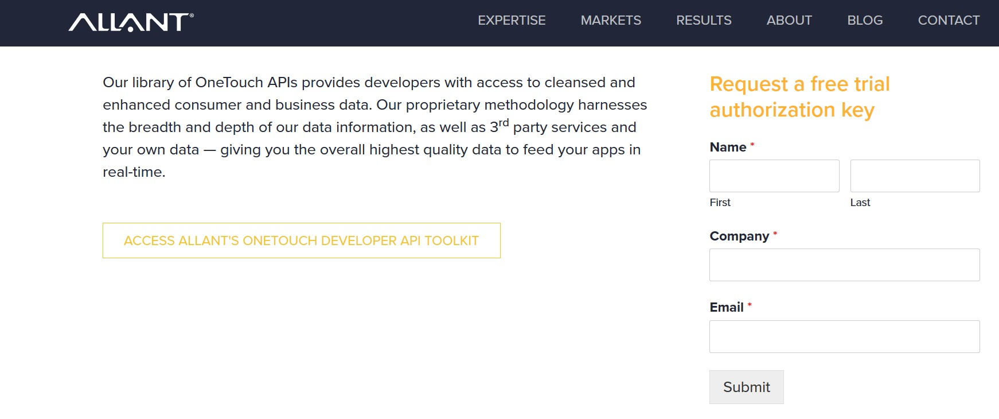

# Consumer Data Enrichment (Allant Group - API)
This Treasure Box demonstrates how to leverage the Allant Group ConsumerEnhancement API to retrieve third party data for consumers.  Which can then be used in subsequent personalization, predictive scoring and other segmentation related processes.

## Prerequisites
### Consumer names and geographic addresses
The included workflow leverages variables to map name and address fields from the specified database (enrich.source_database) and table (enrich.source_table).
If you do not overide the database variables (enrich.source_database, enrich.target_database), you will need to run the command list under "Prepare database".
The workflow will create the necessary source table (and "seed" it with one consumer record) if the table doesn't exist or is empty.  The structure of this default table contains fields for both parsed and/or concatenated name and address fields.

### Allant Group apikey
An Allant Group apikey is required to evaluate/test Allant's Consumer Data Enrichment API.  Requests for a (free) test  apikey can be made at https://www.allantgroup.com/onetouch-apis/ (a screen shot of the request form is at the end of this section)

Allant also performs data evaluations and larger "Proof of Concepts" for prospective clients.  For larger scale testing and/or enrichment processes, Allant recommends batch/file processing when the real-time api isn't required.




## Initial Setup
### Push workflow and set secret
Download this Treasure Box and push it to your TD environment, then set your apikey secret in the project.
```
$ td workflow push allant_consumer_enrichment
$ td wf secrets --project allant_consumer_enrichment --set apikey
```

### Prepare database
This step is only required, if you use the defaults for the <strong>enrich.source_database</strong> and/or <strong>enrich.target_database</strong>, or the value you set these variables to is not a pre-existing database.

```
$ td db:create enrich_consumer
```
Note:  If the values you set for source and target database variables are different, you will need to run the create for each database that doesn't exist.

## High Level Process Flow of allant_demographic_enrich.dig

1. Create (and seed) the source database table if it doesn't exist and the create_source variable is set to true 
2. Create the database table to store the enriched consumer data.
3. Run query to return consumer records for which enriched data is desired.
4. Make Rest API call(s) to AllantGroup to retreive consumer data.
5. Store enriched consumer data in the specified target database table.

## Specifying data to be enriched (Source Data)
The Allant Consumer Data enrichment API requires consumer name information, address line 1, and either "City and State" or "zip" to be populated.  
The workflow is configured to accept two methods for specifying the consumers you would like to enrich with data.

### 1. Inserting data into the default table (enrich_consumer.consumer_source)
Example 1: Inserting records from an existing database table which has separate fields for various name components (i.e. first_name, last_name)
```
insert into enrich_consumer.consumer_source (key_col, first_name, middle_name, last_name, suffix, address1, address2, city, st, zip, zip4)
select cast(key_field as varchar)
     , first_name_field
     , middle_name_field
     , last_name_field
     , suffix_field
     , address_line_1_field
     , address_line_2_field
     , city_field
     , state_field
     , zip_field
     , zip4_field
  from your_databasename.your_tablename
;
```
Example 2: Inserting records from froma an existing database table which has a single field for the consumer name (i.e. name or fullname)
```
insert into enrich_consumer.consumer_source (key_col, full_name, address1, address2, city, st, zip, zip4)
select cast(key_field as varchar)
     , full_name_field
     , address_line_1_field
     , address_line_2_field
     , city_field
     , state_field
     , cast(zip_field as varchar)
     , cast(zip4_field as varchar)
  from your_databasename.your_tablename
;
```
Notes:
- In both of the insert statements above you can either remove any columns that don't exist in your source table, from both the column list and select clause, or just place "cast(null as varchar)" in the select clause for each of the columns for which your source table doesn't have a corresponding field.

Skip the next section and proceed to the "Specifying where to store enriched demographic data (Target Data)" section

### 2. Overriding the source variables (source_database, source_table)
The query used to retreive the Consumer data that is to be enriched was written to support passing in variables (database, tablename, field_names).  This allows the workflow to read source data from an existing database table, without having to modify SQL query file.  Following is a listing of the variables and a brief description of how to use them:

#### Required variables:
- source_database -  Should contain the name of a pre-existing database
- source_table - Should contain the name of a pre-existing database table from which to select the consumer data.
- key_column (required) - Should contain the column name for the field that is considered the unique key for a consumers name/address (used to delete prior data in the target table when the replace_table variable is set to false)	

Notes:
- If the table specified in the "source_table" variable doesn't exist and the "create_source_table" variable is set to true, the workflow will create the source table and populate a sample consumer record.
- If the "replace_table" variable is set to true, the workflow will drop and recreate the target table and the enriched consumer data will be inserted as it is processed.
- If the "replace_table" variable is set to false, it will only create the target table if it doesn't already exist. Enriched consumer data will be upserted (based on the column specified in the "key_column" variable) into the target table specified.

#### Field Name Variables: (all but "address2_fields_in_order" are required)

Note:  These variables can either contain the name of a single column, or a comma separated list of columns to concatenate.  If setting to multiple columns make sure to put them in the correct order and use coalesce() to properly handle nullable columns.  Also keep in mind that you will more than likely want to insert a literal value of a space (' ') between components.

- name_fields_in_order - default "coalesce(first_name,''),' ',coalesce(middle_name,''),' ',coalesce(last_name,''),' ',coalesce(suffix,'')"
- address1_fields_in_order - default "address1"
- address2_fields_in_order - default "''"
- city_st_zip_fields_in_order - default "coalesce(city,''),' ',coalesce(st,''),' ',coalesce(cast(zip as varchar),'')"

#### Optional Source filter/sorting Variables: 
- source_where_clause - Should be populated with either an empty string "" or a valid where clause (i.e. "where state = 'IL'")
- source_order_by_clause - Should be populated with either an empty string "" or a valid order by clause (i.e. "order by cust_segment")
- source_limit_rows_clause - Should be populated with either an empty string "" or a valid limit clause (i.e. "limit 100")


## Specifying where to store enriched demographic data (Target Data)
As described in the High Level Process Flow section, this workflow will create a target table (if necessary) and load the enriched demographic data into a default table structure.  The database and name of the tables are determined by the variables describe at the bottom of this section.

Note:  The structure of the target table leveraged in this Treasure Box, is based on a select list of attributes that the Allant Group has made available as part of the free trial offering.

- target_database - default "enrich_consumer"
- target_table - default "consumer_enriched_data"

## Variables that control how the Source/Target tables are created and populated
As described in the High Level Process Flow section, this workflow will create the source/target tables (if necessary) and load the enriched demographic data into a default table structure.  The following variable determine how the source/target tables are created and/or loaded

- replace_table - default "true"  When set to "true" the target table will be dropped and re-created everytime the workflow is run and all data is appended to the table.  When set to "false" the target table will only be created if it doesn't already exist, and a delete will be issued for the current key (where key_column = key_value) prior to the insert for each enriched record.
- create_source_table - default "true"  When set to "true" the source table will be created if it doesn't already exists and a sample consumer record will be inserted if the table is empty.  When set to "false" the source table must already exist and only the data already in the source table will be processed.

## Additional example scenarios for setting Source Field Name variables
### Name related field scenarios
#### Only First and Last Name fields available ("first_name", "last_name")
```
name_fields_in_order: "coalesce(first_name,''),' ',coalesce(last_name,'')"
```
Note:  This would also work if people put middle initial at end of first name field or beginning of last name field.  Would also work if suffix was added to the end of the last name field
#### One Name field available ("fullname")
```
name_fields_in_order: "fullname"
```
#### Prefix and one Name field available ("prefix", "name")
```
name_fields_in_order: "coalesce(prefix,''),' ',coalesce(name,'')"
```
### Address related field scenarios
#### Only one street address field ("street_address")
```
address1_fields_in_order: "street_address"
address2_fields_in_order: "''"
```
Note:  address2_fields_in_order must be set to "''" in this case.  This does support case when apartment number is at the end of the street address
### "City, State Zip" related field scenarios
#### Only have city and state fields ("city", "state")
```
city_st_zip_fields_in_order: "coalesce(city,''),', ',coalesce(state,'')"
```
#### have city, state and two zip fields ("city", "state", "zip", "zip4")
```
city_st_zip_fields_in_order: "coalesce(city,''),', ',coalesce(state,''),' ',coalesce(cast(zip as varchar),''),'-',coalesce(cast(zip4 as varchar),'')"
```
#### no city and state fields but have zip field ("zip")
```
city_st_zip_fields_in_order: "cast(zip as varchar)"
```

## Allant Data Categories


## Others
If you have any questions, please contact your Customer Success/Solution Architect of TD.
