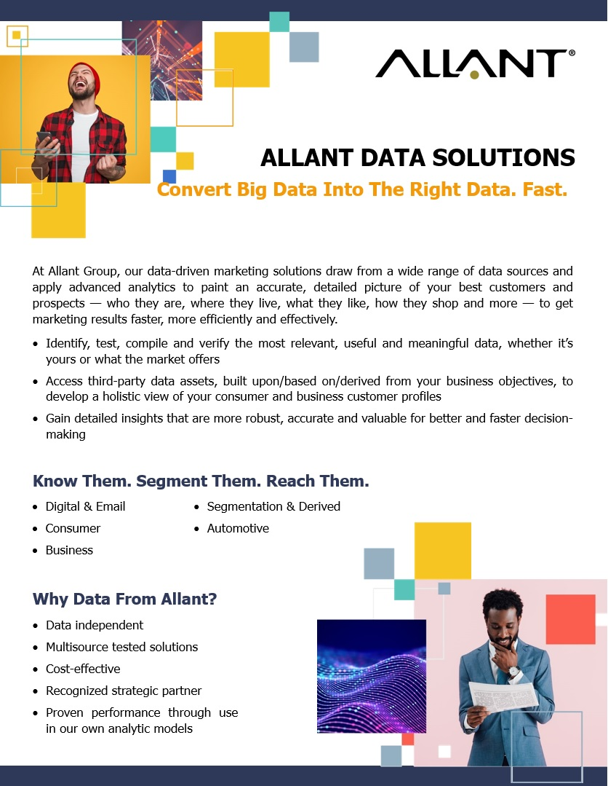

# Treasure-Boxes
Allant Group - ARM Treasure Data - Treasure Boxes

## Consumer Data Enrichment (Allant Group - API)
This Treasure Box demonstrates how to leverage the Allant Group ConsumerEnhancement API to retrieve third party data for consumers.  Which can then be used in subsequent personalization, predictive scoring and other segmentation related processes.

## Prerequisites
### Allant Group apikey
An Allant Group apikey is required to evaluate/test Allant's Consumer Data Enrichment API.  Requests for a (free) test  apikey can be made at https://www.allantgroup.com/onetouch-apis/ (a screen shot of the request form is at the end of this section)

Allant also performs data evaluations and larger "Proof of Concepts" for prospective clients.  For larger scale testing and/or enrichment processes, Allant recommends batch/file processing when the real-time api isn't required.

### Consumer names and postal addresses (Consumer Data Enrichment)
The included workflow leverages variables to map name and address fields from the specified database (enrich.source_database) and table (enrich.source_table).
If you do not overide the database variables (enrich.source_database, enrich.target_database), you will need to run the command list under "Prepare database".
The workflow will create the necessary source table (and "seed" it with one consumer record) if the table doesn't exist or is empty.  The structure of this default table contains fields for both parsed and/or concatenated name and address fields.

## Allant Data Solutions

## Allant Data Categories

## Others
If you have any questions, please contact your Customer Success/Solution Architect of TD.
