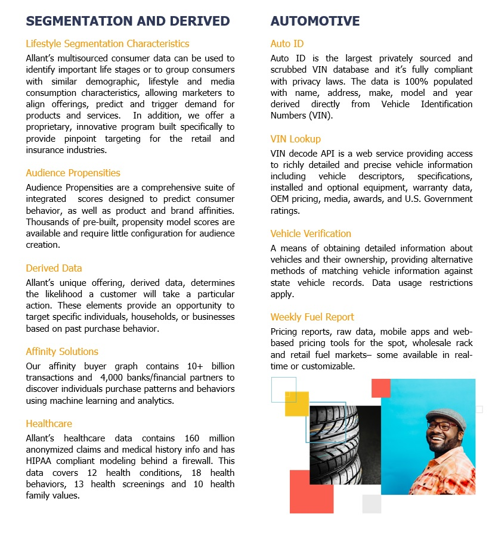

# Treasure-Boxes
  As an ARM Treasure Data strategic partner (<a href="https://www.allantgroup.com/about/partners/">Partners</a>) The Allant Group provides Data and Services to assist customers with CDP implementations and/or enhancements.  The Treasure Boxes in this repository are working examples of how to integrate Allant Data Services into your Treasure Data enviroment.  Following is a list of the Treasure Boxes currently available:

- <a href="https://github.com/Allant-Tools-Systems/Treasure-Boxes/tree/master/Consumer%20Data%20Enrichment"><strong>Consumer Data Enrichment</strong></a> - This Treasure Box demonstrates how to leverage the Allant Group ConsumerEnhancement API to retrieve third party data for consumers.  Which can then be used in subsequent personalization, predictive scoring and other segmentation related processes.  This Treasure Box is setup for some commonly used enrichment attributes, the data dictionary for then <a href="https://github.com/Allant-Tools-Systems/Treasure-Boxes/blob/master/Metadata/Data%20Dictionary%20-%20Enrichment%20-%20Sample.xlsx">sample attributes</a> (as well as a more <a href="https://github.com/Allant-Tools-Systems/Treasure-Boxes/blob/master/Metadata/Data%20Dictionary%20-%20Enrichment.xlsx">comprehensive list</a>) can be found in the <a href="https://github.com/Allant-Tools-Systems/Treasure-Boxes/tree/master/Metadata">Metadata directory</a>.
- <strong>Name & Postal Address Hygiene</strong> - Coming Soon

## Prerequisites
### Allant Group apikey
An Allant Group apikey is required to evaluate/test Allant's Consumer Data Enrichment API.  Requests for a (free) test apikey can be made at https://www.allantgroup.com/onetouch-apis/ (a screen shot of the request form is at the end of this section)

Allant also performs data evaluations and larger "Proof of Concepts" for prospective clients.  For larger scale testing and/or enrichment processes, Allant recommends batch/file processing when the real-time api isn't required.

## Additional Information
### Allant Data Solutions

### Allant Data Categories

